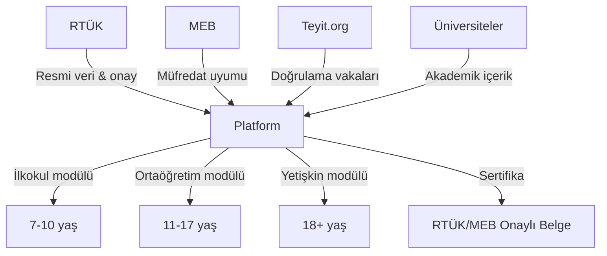

# 🎯 Medya Okuryazarlığı Eğitim Platformu — Proje Analiz Raporu

> **Proje Adı:** Medya Okuryazarlığı Dijital Eğitim Platformu  
> **Tarih:** 18 Mayıs 2026  
> **Durum:** Ön Analiz & Fizibilite

---

## 1. Mevcut Durum Analizi

### 1.1 Türkiye'de Medya Okuryazarlığı — Boşluk Analizi

| Alan | Mevcut Durum | Eksiklik |
|------|-------------|----------|
| **MEB Müfredatı** | 7-8. sınıf seçmeli ders (haftada 2 saat) | İlkokul ve yetişkin düzeyi yok |
| **RTÜK Faaliyetleri** | Seminer, kamu spotu, çizgi film, araştırma | **Etkileşimli dijital platform yok** |
| **Dijital İçerik** | medyaokuryazarligi.gov.tr → statik bilgi | Gamifikasyon, progression, üyelik yok |
| **Sertifika** | Genel katılıma açık çevrimiçi sertifika programı yok | Büyük fırsat alanı |
| **Vaka Analizi** | Akademik makaleler var, interaktif değil | Etkileşimli vaka simülasyonu yok |

> [!IMPORTANT]
> **Kritik Bulgu:** RTÜK'ün doğrudan genel katılıma açık, çevrimiçi bir medya okuryazarlığı sertifika programı bulunmamaktadır. Bu, projemizin en büyük fırsat alanıdır.

### 1.2 Neden Bu Proje Benzersiz?

1. **Türkiye'de bir ilk:** 3 yaş grubuna özel, gamifikasyonlu, interaktif dijital platform
2. **RTÜK verisiyle beslenen** gerçek vaka analizleri
3. **Bölüm atlamalı progression** sistemi (Duolingo modeli)
4. **Sertifika programı** — RTÜK onaylı potansiyel
5. **Türkçe içerik** — Mevcut global platformlar (Bad News, Harmony Square) İngilizce

---

## 2. Hedef Kitle Segmentasyonu

### 🟢 Düzey 1: İlkokul (7-10 yaş)
- **Yaklaşım:** Oyun tabanlı, görsel ağırlıklı, karakter odaklı
- **Maskot:** "Medya Dedektifi" karakteri
- **İçerik tonu:** Eğlenceli, renkli, ödüllendirici
- **Modül süresi:** 10-15 dakika (kısa dikkat süresi)
- **Ebeveyn paneli:** İlerleme takibi

### 🔵 Düzey 2: Ortaöğretim (11-17 yaş)
- **Yaklaşım:** Vaka analizi odaklı, sosyal medya simülasyonları
- **İçerik tonu:** Gerçekçi, meydan okuyucu, sosyal
- **Modül süresi:** 20-30 dakika
- **Sosyal özellikler:** Takım görevleri, liderlik tablosu
- **MEB uyumu:** 7-8. sınıf müfredatıyla entegre

### 🟣 Düzey 3: Yetişkin (18+ yaş)
- **Yaklaşım:** Profesyonel, veri odaklı, sertifika hedefli
- **Alt gruplar:** Veliler, öğretmenler, medya çalışanları, genel yetişkin
- **İçerik tonu:** Analitik, pratik, uygulanabilir
- **Modül süresi:** 30-45 dakika
- **Sertifika:** Tamamlama sertifikası

---

## 3. Modül Yapısı — Eğitim Programı

### 3.1 Ana Modüller (Her düzey için uyarlanacak)

```
📚 MODÜL 1: Medya Nedir?
├── 1.1 Medya türleri (geleneksel, dijital, sosyal)
├── 1.2 Medyanın toplumsal rolü
├── 1.3 Medya tüketim alışkanlıklarım
└── 🎯 Vaka: Kendi medya günlüğünü tut

📚 MODÜL 2: Haber ve Bilgi Değerlendirme
├── 2.1 Güvenilir kaynak nedir?
├── 2.2 5W1H analizi
├── 2.3 Kaynak çapraz kontrolü
└── 🎯 Vaka: Gerçek vs. sahte haber ayırt etme simülasyonu

📚 MODÜL 3: Dezenformasyon ve Manipülasyon
├── 3.1 Dezenformasyon türleri (çarpıtma, hatalı ilişkilendirme, astroturfing)
├── 3.2 Bot ve trol hesapları tanıma
├── 3.3 Deepfake ve yapay zeka ile üretilen içerikler
└── 🎯 Vaka: 2021 Orman Yangınları #helpturkey analizi

📚 MODÜL 4: Sosyal Medya Okuryazarlığı
├── 4.1 Algoritmaların çalışma mantığı
├── 4.2 Filtre balonları ve yankı odaları
├── 4.3 Dijital ayak izi ve mahremiyet
└── 🎯 Vaka: Sosyal medya akışı simülasyonu

📚 MODÜL 5: Görsel Okuryazarlık
├── 5.1 Fotoğraf ve video manipülasyonu
├── 5.2 Ters görsel arama teknikleri
├── 5.3 AI üretimi görselleri tanıma
└── 🎯 Vaka: Manipüle edilmiş görselleri bul

📚 MODÜL 6: Reklam ve İkna Teknikleri
├── 6.1 Reklam stratejileri ve hedefleme
├── 6.2 Influencer pazarlama ve gizli reklamlar
├── 6.3 Duygusal manipülasyon teknikleri
└── 🎯 Vaka: Reklam analizi atölyesi

📚 MODÜL 7: Dijital Güvenlik
├── 7.1 Siber zorbalık ve korunma
├── 7.2 Kişisel veri güvenliği
├── 7.3 Çevrimiçi dolandırıcılık türleri
└── 🎯 Vaka: Phishing simülasyonu

📚 MODÜL 8: Medya Üretimi ve Etik
├── 8.1 Sorumlu içerik üretimi
├── 8.2 Telif hakları ve kaynak gösterme
├── 8.3 Dijital vatandaşlık
└── 🎯 Vaka: Kendi haberini yaz/üret

📚 MODÜL 9: RTÜK ve Medya Düzenleme
├── 9.1 RTÜK'ün rolü ve görevleri
├── 9.2 Akıllı İşaretler sistemi
├── 9.3 Yayın ilkeleri ve şikâyet mekanizmaları
└── 🎯 Vaka: Akıllı işaretlerle içerik sınıflandırma

📚 MODÜL 10: Kriz Dönemlerinde Medya
├── 10.1 Afet haberciliği ve dezenformasyon
├── 10.2 Sağlık krizlerinde bilgi kirliliği
├── 10.3 Doğrulama platformları (Teyit.org vb.)
└── 🎯 Vaka: COVID-19 döneminde yanlış bilgi analizi
```

### 3.2 Düzeye Göre Modül Uyarlama

| Modül | İlkokul Versiyonu | Ortaöğretim Versiyonu | Yetişkin Versiyonu |
|-------|-------------------|----------------------|-------------------|
| Dezenformasyon | "Yalan Avcısı" oyunu | Gerçek tweet analizi | İstatistiksel veri analizi |
| Sosyal Medya | "Güvenli Paylaşım" hikayesi | Algoritma simülasyonu | Veri gizliliği denetimi |
| Görsel Okur. | "Farkı Bul" oyunu | Deepfake tanıma challenge | Araçlarla doğrulama atölyesi |

---

## 4. Gamifikasyon & Progression Sistemi

### 4.1 Seviye Sistemi
```
🥉 Başlangıç    → Modül 1-2 tamamlama
🥈 Keşifçi      → Modül 3-4 tamamlama
🥇 Analist      → Modül 5-7 tamamlama
💎 Medya Uzmanı  → Modül 8-10 tamamlama
🏆 Sertifikalı   → Final sınavı geçme
```

### 4.2 Oyunlaştırma Elementleri
- **XP Puanları:** Her ders/quiz tamamlamada kazanılır
- **Rozetler:** "Doğrulama Ustası", "Reklam Dedektifi", "Dijital Vatandaş" vb.
- **Günlük Seriler (Streaks):** Kesintisiz giriş ödülleri
- **Liderlik Tablosu:** Haftalık/aylık sıralama
- **Takım Görevleri:** Grup halinde vaka analizi çözme
- **Bölüm Kilidi:** Önceki bölüm tamamlanmadan sonrakine geçilemez

### 4.3 Etkileşimli Vaka Analizleri
- **Simülasyon:** Sahte bir sosyal medya akışı içinde dezenformasyonu bulma
- **Karar Ağaçları:** "Bu haberi paylaşır mısın?" senaryoları
- **Zamana Karşı:** Hızlı doğrulama challenge'ları
- **Rol Yapma:** "Editör ol" — hangi haberi yayınlarsın?

---

## 5. RTÜK Entegrasyonu — Veri ve İçerik Kaynakları

### 5.1 RTÜK'ten Alınabilecek Resmi Veriler

| Kaynak | Kullanım Alanı |
|--------|---------------|
| Akıllı İşaretler veritabanı | Modül 9 - İçerik sınıflandırma pratikleri |
| Medya araştırma raporları | Vaka analizleri için istatistik ve veri |
| Kamu spotları ve çizgi filmler | İlkokul modüllerinde eğitim materyali |
| Yayın ihlali kararları | Yetişkin modülünde gerçek vaka incelemeleri |
| Medya ve Çocuk Dergisi | İlkokul içerik kaynağı |
| Eğitici eğitimi materyalleri | Öğretmen modülü için temel |

### 5.2 Potansiyel İş Birliği Modeli



---

## 6. Teknik Mimari Önerisi

### 6.1 Teknoloji Stack'i
| Katman | Teknoloji | Gerekçe |
|--------|-----------|---------|
| Frontend | Next.js + React | Mevcut altyapı uyumu, SSR/SEO |
| Styling | CSS + Animasyonlar | Premium, dinamik arayüz |
| Backend | Next.js API Routes | Full-stack tek proje |
| Veritabanı | PostgreSQL + Prisma | Kullanıcı ilerlemesi, içerik yönetimi |
| Auth | NextAuth.js | Üyelik sistemi |
| Medya | Cloudinary/S3 | Video, görsel, animasyon |
| Gamifikasyon | Custom engine | XP, rozet, seviye sistemi |
| Analytics | Custom + GA | Öğrenme analitiği |

### 6.2 Temel Veritabanı Modelleri
```
User → Profile, Progress, Achievements
Module → Lessons, Quizzes, CaseStudies
Progress → CompletedLessons, XP, Badges, Streak
CaseStudy → Scenario, Choices, Outcomes, MediaAssets
Certificate → User, CompletionDate, Level, VerificationCode
```

### 6.3 Sayfa Yapısı
```
/                    → Landing page (etkileyici tanıtım)
/kayit               → Üyelik / Giriş
/seviye-sec           → İlkokul / Ortaöğretim / Yetişkin seçimi
/dashboard            → Kullanıcı paneli (ilerleme, rozetler)
/modul/[id]           → Modül detay sayfası
/modul/[id]/ders/[id] → Ders içeriği (interaktif)
/modul/[id]/quiz      → Modül sonu quiz
/vaka/[id]            → Etkileşimli vaka analizi
/profil               → Profil, sertifikalar, istatistikler
/liderlik             → Liderlik tablosu
/admin                → İçerik yönetim paneli
/sertifika/[code]     → Sertifika doğrulama
```

---

## 7. Türkiye'ye Özgü Gerçek Vaka Analizi Havuzu

Platformda kullanılabilecek Türkiye'den gerçek vakalar:

| Vaka | Modül | Dezenformasyon Türü |
|------|-------|-------------------|
| 2021 Orman Yangınları #helpturkey | Mod 3, 10 | Hatalı ilişkilendirme |
| COVID-19 aşı dezenformasyonu | Mod 3, 10 | Çarpıtma, uydurma |
| 15 Temmuz sosyal medya yansımaları | Mod 4 | Bağlam dışı kullanım |
| Deprem sonrası sahte yardım hesapları | Mod 7 | Dolandırıcılık |
| Influencer gizli reklam vakaları | Mod 6 | Gizli reklam |
| Seçim dönemlerinde bot hesaplar | Mod 3, 4 | Astroturfing |
| Deepfake ünlü videoları | Mod 5 | AI manipülasyonu |
| Viral yanlış sağlık bilgileri | Mod 2, 3 | Uydurma içerik |

> [!NOTE]
> Vakalar tarafsız ve eğitici bir perspektifle sunulmalı, siyasi taraf tutmaktan kaçınılmalıdır. RTÜK'ün yayınladığı resmi raporlar ve Teyit.org verileri birincil kaynak olarak kullanılabilir.

---

## 8. Gelir Modeli & Sürdürülebilirlik

| Model | Açıklama |
|-------|----------|
| **Freemium** | İlk 3 modül ücretsiz, sonrası üyelik |
| **Kurumsal Lisans** | Okullar ve kurumlar için toplu lisans |
| **Sertifika Ücreti** | Final sınavı + sertifika için ücret |
| **Kamu Desteği** | RTÜK / MEB sponsorluğu |
| **AB Fonları** | Dijital okuryazarlık projeleri fon havuzu |
| **Reklamsız Model** | Eğitim platformu olarak reklam almama prensibi |

---

## 9. Rekabet Analizi

| Platform | Kapsam | Dil | Gamifikasyon | Türkiye Odaklı |
|----------|--------|-----|-------------|---------------|
| Bad News Game | Dezenformasyon | EN | ✅ | ❌ |
| Harmony Square | Siyasi manipülasyon | EN | ✅ | ❌ |
| NewsFeed Defenders | Sosyal medya | EN | ✅ | ❌ |
| medyaokuryazarligi.gov.tr | Genel bilgi | TR | ❌ | ✅ |
| **Bu Proje** | **Kapsamlı eğitim** | **TR** | **✅** | **✅** |

> [!TIP]
> Projenin en büyük avantajı: Türkçe + Türkiye vakaları + Gamifikasyon + 3 yaş grubu + RTÜK entegrasyonu kombinasyonunun **dünyada tek** olması.

---

## 10. Proje Yol Haritası

### Faz 1 — Temel Altyapı (Ay 1-2)
- [x] Proje yapısı ve teknik altyapı kurulumu
- [x] Üyelik sistemi ve kullanıcı profili (ProgressContext)
- [x] Seviye seçimi ve dashboard
- [x] Gamifikasyon motoru (XP, rozet, streak)
- [x] İlerleme sıfırlama ve yerel durum yönetimi

### Faz 2 — İçerik & İlk Modüller (Ay 2-4)
- [x] Modül 1-3 içerik üretimi (3 düzey adaptasyonlu dersler)
- [x] İlk etkileşimli vaka analizleri (Orman Yangınları & Aşı Komploları)
- [x] Quiz sistemi ve anında değerlendirme
- [x] İlkokul düzeyi için maskot ve diyaloglar

### Faz 3 — Tam Platform (Ay 4-6)
- [x] Modül 4-10 içerik üretimi (dinamik şablonlar)
- [x] Liderlik tablosu ve sosyal profil yapılandırması
- [x] PDF & Resmi Yazıcı optimizasyonlu Sertifika sistemi
- [x] RTÜK veri entegrasyonlu resmi vaka analiz odası

### Faz 4 — Lansman & Büyüme (Ay 6+)
- [ ] Beta test (seçili okullar)
- [ ] RTÜK / MEB resmi onay süreci
- [ ] Kamuoyu lansmanı
- [ ] Sürekli içerik güncelleme döngüsü

---

## 11. Risk Analizi

| Risk | Olasılık | Etki | Azaltma Stratejisi |
|------|---------|------|-------------------|
| RTÜK onayı alınamama | Orta | Yüksek | Erken iletişim, danışma kurulu |
| İçerik güncelliğini kaybetme | Yüksek | Orta | Otomatik güncelleme döngüsü |
| Düşük kullanıcı tutundurma | Orta | Yüksek | Güçlü gamifikasyon, push bildirim |
| Siyasi hassasiyet | Yüksek | Yüksek | Tarafsız, veri odaklı yaklaşım |
| Teknik ölçekleme | Düşük | Orta | Cloud-native mimari |

---

## 12. Sonuç ve Öneri

> [!IMPORTANT]
> Bu proje, Türkiye'de medya okuryazarlığı alanında **ciddi bir boşluğu** dolduracak potansiyele sahiptir. RTÜK'ün mevcut çalışmaları statik ve tek yönlüdür; bu platform, etkileşimli, kişiselleştirilmiş ve ölçülebilir bir eğitim deneyimi sunarak fark yaratabilir.

### Önerilen İlk Adımlar:
1. **RTÜK ile ön görüşme** — Veri erişimi ve potansiyel onay sürecini başlatma
2. **MEB müfredat uyumu** — 7-8. sınıf seçmeli ders müfredatıyla senkronizasyon
3. **Prototip geliştirme** — Landing page + 1 örnek modül (demo amaçlı) - **TAMAMLANDI**
4. **İçerik ekibi kurma** — İletişim/medya akademisyenleri ile iş birliği
5. **Fon araştırması** — AB dijital okuryazarlık fonları ve TÜBİTAK destekleri

---

*Bu analiz, projenin teknik ve içerik çerçevesini oluşturmak için hazırlanmıştır. Geliştirme sürecinin temel referansıdır.*
